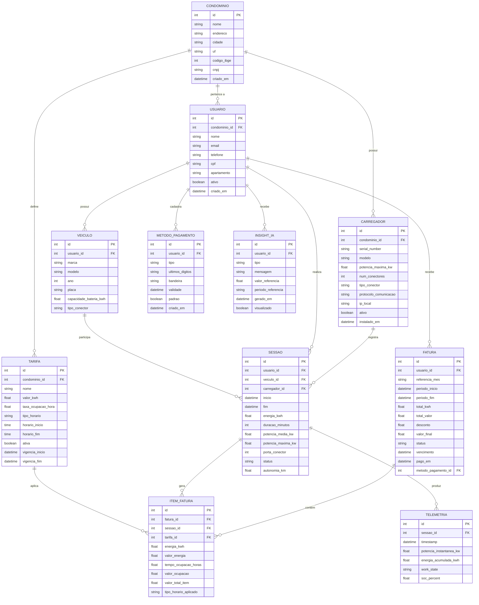

# EV ChargeOps — GoodWe-01

## Equipe

| Nome | RM |
|------|-----|
| *Gabriel de Leão da Rocha* | *RM571330* |
| *Guilherme Alves Nune* | *RM572754* |
| *(preencher)* | *(preencher)* |
| *(preencher)* | *(preencher)* |

---

## Descrição do Problema

Infraestruturas de recarga compartilhada — em condomínios, edifícios corporativos e campi — carecem de mecanismos integrados para:

- Estruturar sessões de recarga **por usuário**;
- Calcular consumo individual e aplicar **rateio justo**;
- Oferecer uma **experiência digital clara** para moradores e gestores;
- Gerar **inteligência operacional** a partir dos dados de uso.

Cada sessão produz dados úteis (duração, kWh, horário, potência), mas sem uma plataforma de gestão eles permanecem como registros brutos, incapazes de sustentar cobrança automatizada ou tomada de decisão.

**Questão central:** *Como transformar sessões de recarga de veículos elétricos em uma infraestrutura compartilhada em dados estruturados, rateio justo e inteligência acionável?*

### Nossa Proposta

O **EV ChargeOps** é uma plataforma que conecta o carregador GoodWe HCA G2 a um aplicativo móvel e a um dashboard de gestão, apoiado por inteligência artificial. A solução substitui o uso de cartões RFID físicos por autenticação digital via app — simplificando o onboarding, eliminando a limitação de cartões físicos e garantindo que **toda sessão seja monitorada e vinculada a um usuário**.

**Decisões de design:**
- **App como autenticação única** — o usuário se cadastra, faz login e libera o carregador pelo app. O backend envia comando `start` via Modbus TCP. Não há cartão físico.
- **Sem entidade "Unidade/Vaga"** — o vínculo é direto: Usuário → Condomínio. O campo `apartamento` no cadastro do usuário é informativo para o gestor; não há necessidade de modelar vagas como entidade separada.
- **IA como motor lógico** — não decorativa: detecta anomalias, prevê consumo, classifica perfis e otimiza horários.

---

## Frente 1 — Contexto e Problema

### Ciclo de Vida Técnico de uma Sessão de Recarga

Para que o EV ChargeOps consiga gerenciar o ecossistema de recarga de forma inteligente, é fundamental compreender a anatomia técnica de uma sessão. Desde o momento em que o cabo é conectado ao veículo até a sua desconexão, ocorre uma sequência padronizada de eventos físicos, elétricos e digitais.

O funcionamento de uma recarga em corrente alternada (AC) — padrão do carregador GoodWe HCA G2 — segue normas internacionais (IEC 61851) e divide-se nas seguintes etapas:

#### Fluxo passo a passo

| Etapa | Descrição |
|-------|-----------|
| **1. Conexão física e detecção** (Estado A → B) | O usuário pluga o conector no veículo. O carregador detecta a conexão através do pino PP (Proximity Pilot), que altera a resistência do circuito, indicando que o cabo está firmemente travado. |
| **2. Autenticação e autorização** | O carregador permanece travado e em estado de espera até que a identidade do usuário seja validada. No EV ChargeOps, isso acontece quando o usuário ativa a sessão via app (que se comunica com o backend via Modbus TCP para liberar o carregador). |
| **3. Negociação de parâmetros** (Handshake) | Com o usuário autorizado, carregador e veículo negociam pelo pino CP (Control Pilot) via modulação PWM. O carregador informa a corrente máxima disponível e o veículo responde se está pronto para receber energia (Estado C). |
| **4. Entrega de energia** (Fase de carga) | Os contatores internos se fecham e a energia flui para o inversor interno do carro (On-Board Charger), que converte AC em DC para a bateria. Sensores medem o consumo em tempo real. |
| **5. Encerramento e desconexão** | A sessão encerra quando: a bateria atinge 100%, o usuário comanda a interrupção via app, ou ocorre falha de segurança. Os contatores abrem, a energia é cortada e o plugue é liberado. |

#### Dados gerados durante a sessão

Cada recarga gera dados brutos que alimentam o sistema, divididos em duas categorias:

**Metadados de sessão:**
- ID do carregador e ID do usuário
- Timestamp de início e fim
- Duração total (minutos)

**Telemetria de desempenho (tempo real):**
- **Energia consumida** — volume acumulado em kWh
- **Potência instantânea** — demanda instantânea em kW
- **Tensão (V) e corrente (A)** — estabilidade da rede do condomínio
- **Tempo de ociosidade pós-carga** — veículo plugado com consumo zerado

#### Mecanismos de captura

| Via | Descrição |
|-----|-----------|
| **Nuvem (SEMS+ API)** | O HCA G2 envia dados para servidores GoodWe via Wi-Fi/LAN. O EV ChargeOps consome via HTTP/JSON. |
| **Protocolos locais (Modbus TCP/RTU)** | Comunicação direta via rede local (porta 502) ou RS-485, permitindo leituras em tempo real e comandos de controle de carga. |

---

### Modelos de Negócio para Recarga Compartilhada

A viabilidade financeira de uma infraestrutura de recarga depende diretamente do modelo de negócio adotado. No Brasil e no mundo, o ecossistema evoluiu de conveniência (recarga gratuita) para modelos monetizados e auditáveis. As cinco principais verticais são:

| Modelo | Como funciona | Vantagens | Limitações |
|--------|---------------|-----------|------------|
| **Recarga gratuita** | Estabelecimento assume o custo total como benefício (shoppings, hotéis, campi) | Ferramenta de marketing e atração de fluxo | Inviável no longo prazo; gera o problema do "carona" |
| **Cobrança por kWh** | Usuário paga pela energia injetada na bateria. Modelo mais difundido em eletropostos públicos | O mais justo: paga-se pelo consumo real | Exige medidores calibrados (Inmetro); não resolve ociosidade de vaga |
| **Cobrança por tempo** | Tarifação pelo tempo total conectado, independente da energia transferida | Estimula rotatividade das vagas | Injusto para veículos com On-Board Chargers limitados (3,7 kW vs 22 kW pagam o mesmo por minuto) |
| **Assinatura mensal** | Mensalidade fixa com franquia de energia ou acesso ilimitado em horários definidos | Receita previsível para operador; custo previsível para usuário | Exige gestão rigorosa de agendamento para evitar falta de acesso em horários de pico |
| **Rateio condominial** | Consumo total dos carregadores medido centralmente e dividido entre condôminos (igualitário ou proporcional) | Dispensa gateways de pagamento; valor vai direto no boleto condominial | Depende de software confiável para auditar consumo individual e evitar contestações |

---

### Aprofundamento — Opção A: Análise de Mercado

Para fundamentar o posicionamento estratégico e a diferenciação técnica do EV ChargeOps, foi realizado o mapeamento analítico de três soluções consolidadas que operam na gestão de infraestruturas de recarga compartilhada.

#### 1. Zaptec Portal

| Aspecto | Descrição |
|---------|-----------|
| **Problema que resolve** | Gerenciamento de estações em condomínios e frotas corporativas de alta densidade, focando na mitigação da sobrecarga da rede elétrica local |
| **Funcionalidades** | Algoritmo dinâmico de balanceamento de carga e fases (Dynamic Phase Balancing); controle de acesso e autenticação; relatórios de consumo; atualização de firmware em lote via nuvem |
| **Modelo de negócio** | Hardware proprietário + licenciamento SaaS para administradoras e gestores de frotas |
| **Limitações** | Ecossistema dependente de hardware próprio, restringindo interoperabilidade com estações de terceiros. Elevado custo de importação e suporte técnico escasso no Brasil |

#### 2. Wallbox Portal (Módulo Business)

| Aspecto | Descrição |
|---------|-----------|
| **Problema que resolve** | Governança operacional e monitoramento em tempo real de carregadores semiprofissionais em ambientes comerciais e residenciais |
| **Funcionalidades** | Integração com energia solar (Eco-Smart); agendamento por tarifa fora-pico; gerenciamento local via Bluetooth; painel multi-usuário |
| **Modelo de negócio** | Venda do equipamento + software básico gratuito + assinatura mensal por carregador para módulos avançados de faturamento |
| **Limitações** | Interface web complexa para rateios em larga escala. Dependência de Bluetooth em subsolos sem internet gera inconsistência de dados |

#### 3. ChargePoint Cloud Services

| Aspecto | Descrição |
|---------|-----------|
| **Problema que resolve** | Operação de redes abertas e públicas de carregamento, monetizando vagas de estacionamento via energia elétrica |
| **Funcionalidades** | Roteamento de transações financeiras internacionais; mapa global integrado; precificação dinâmica (tempo, ociosidade ou kWh); lista de espera digital |
| **Modelo de negócio** | Taxa percentual sobre transações de recarga + licenciamento anual por ponto conectado |
| **Limitações** | Baixa adaptação à legislação tarifária brasileira (tarifas horo-sazonalizadas, impostos de distribuição). Custos proibitivos para condomínios residenciais nacionais. Hardware certificado obrigatório (ecossistema fechado) |

#### Posicionamento do EV ChargeOps

O EV ChargeOps se diferencia por: (1) **independência de hardware** — integra-se ao GoodWe HCA G2 via protocolo aberto Modbus TCP, sem lock-in; (2) **adequação regulatória brasileira** — modela tarifas conforme RN ANEEL 1.000/2021 e bandeiras tarifárias locais; (3) **autenticação 100% digital** — sem dependência de cartões RFID ou Bluetooth local; (4) **custo acessível** — sem taxa por ponto conectado, modelo SaaS leve para condomínios.

---

### Modelo de Rateio e Comercialização Proposto

O modelo financeiro do EV ChargeOps foi desenvolvido para oferecer flexibilidade, rastreabilidade e justiça distributiva na divisão dos custos energéticos.

#### Variáveis do cálculo

| Variável | Significado | Unidade |
|----------|-------------|---------|
| **(E)** Sessão | Energia consumida na sessão ou acumulado mensal | kWh |
| **(T)** Concessionária | Tarifa vigente da distribuidora local (com ICMS, PIS/COFINS e bandeira tarifária) | R$/kWh |
| **(C)** Fixo mensal | Contribuição fixa do plano recorrente (licenciamento + fundo de manutenção) | R$ |
| **(M)** Margem avulsa | Taxa de conveniência adicionada ao kWh para uso sem assinatura | R$/kWh |
| **(P)** Ociosidade | Penalidade por veículo plugado após carga completa (configurável pelo condomínio) | R$ |

#### Modalidades de comercialização

**Modalidade A — Plano Mensal (Recorrente)**

Direcionado a moradores e usuários frequentes. Taxa fixa de infraestrutura + custo bruto da energia consumida.

```
F(mensal) = Σ(E × T) + C + [P]
```

**Modalidade B — Carga Avulsa**

Direcionado a visitantes e usuários esporádicos. Pagamento prévio via app (Pix ou cartão pré-autorizado) antes da liberação da corrente.

```
V(avulso) = E × (T + M) + [P]
```

#### Regras de negócio e casos excepcionais

| Cenário | Tratamento |
|---------|------------|
| **Autenticação** | 100% via app — elimina cartões RFID. O usuário verifica disponibilidade no mapa, libera e encerra a carga pelo app |
| **Taxa de ociosidade** | Configurável pelo condomínio (ativar/desativar). Após tolerância parametrizável, inicia cobrança por hora. Debitada na fatura mensal ou retida do saldo avulso |
| **Sessão interrompida** | Integridade garantida por leituras parciais contínuas. Cobrança apenas pela energia registrada até o último segundo de conectividade. Na modalidade avulsa, excedente pago é estornado automaticamente |
| **Usuário sem consumo no mês** | Plano mensal: faturado apenas pelo (C) fixo. Carga avulsa: nenhuma cobrança gerada |
| **Múltiplos veículos por conta** | Vinculação por conta do usuário (não por apartamento). Múltiplos veículos no mesmo perfil; métricas isoladas por sessão, consolidadas no mesmo extrato mensal |

---

## Frente 2 — Base Regulatória e Técnica

### Resolução Normativa ANEEL nº 1.000/2021

A [Resolução Normativa ANEEL nº 1.000, de 7 de dezembro de 2021](https://www.gov.br/aneel/pt-br/assuntos/noticias/2022/conheca-a-resolucao-1-000-que-reune-os-direitos-e-deveres-do-consumidor-de-energia-eletrica) consolida as Regras de Prestação do Serviço Público de Distribuição de Energia Elétrica. Ela **revogou a RN 819/2018** (primeira norma específica sobre recarga de veículos elétricos) e incorporou o tema no **Capítulo V — Das Instalações de Recarga de Veículos Elétricos**.

A ANEEL adotou uma **regulamentação mínima**, com foco em evitar interferências na operação da rede e em impedir que a tarifa dos demais consumidores seja impactada pela atividade de recarga. As regras abaixo são as mais relevantes para projetos que envolvam exploração comercial e integração de plataformas de gestão.

### Definição de estação de recarga

**Estação de recarga** (Art. 2º, inciso XV): conjunto de softwares e equipamentos utilizados para o fornecimento de corrente alternada ou contínua ao veículo elétrico, instalado em um ou mais invólucros, com funções especiais de controle e de comunicação, e localizados fora do veículo.

### Exploração comercial

| Artigo | Disposição |
|--------|------------|
| **Art. 554** | É permitida a recarga de veículos elétricos que **não sejam do titular** da unidade consumidora em que se encontra a estação, **inclusive para fins de exploração comercial a preços livremente negociados**. |
| **Art. 557 a 560** | A distribuidora **pode**, a seu critério, prestar a atividade de recarga em sua área de atuação; os preços podem ser livremente negociados quando houver cobrança. |

Em outras palavras: qualquer interessado (condomínio, shopping, posto, empresa etc.) pode operar pontos de recarga acessíveis a terceiros e cobrar pelo serviço, sem que a ANEEL fixe teto de preço. Para isso, porém, é necessário **gerenciamento da estação** — controle de acesso, registro de sessões, supervisão remota — o que reforça a exigência de interfaces de comunicação adequadas.

### Comunicação prévia à distribuidora

| Artigo | Disposição |
|--------|------------|
| **Art. 550** | A instalação de estação de recarga deve ser **comunicada previamente à distribuidora** quando houver necessidade de: **(I)** conexão nova; **(II)** aumento ou redução de carga; ou **(III)** alteração do nível de tensão. |
| **Art. 551** | Os custos de adequação da rede e do sistema de medição seguem os critérios gerais da Resolução. |
| **Art. 553** | Na unidade consumidora com estação de recarga devem ser observadas as **normas e padrões da distribuidora** e as normas dos órgãos oficiais competentes (ABNT, NR-10 etc.). |

A comunicação é feita pelos canais da distribuidora (solicitação de conexão nova, aumento de carga ou alteração de tensão). Cada concessionária detalha o procedimento em norma técnica própria (ex.: Celesc, CPFL, Enel, Light). Instalações que **não alteram** a conexão existente podem não exigir novo processo — mas a conformidade com as normas técnicas locais permanece obrigatória.

### Protocolos abertos de comunicação

| Artigo | Disposição |
|--------|------------|
| **Art. 552** | Equipamentos de recarga que **não sejam exclusivos para uso privado** devem ser compatíveis com **protocolos abertos de domínio público** para: **(I)** comunicação; e **(II)** supervisão e controle remotos. |

**Uso privado exclusivo** — carregador restrito ao titular da unidade consumidora, sem cobrança ou acesso a terceiros — **não** está sujeito a essa exigência.

**Uso não exclusivo** — condomínios, empresas, locais com cobrança ou acesso compartilhado — exige protocolo aberto que permita a uma plataforma de terceiros monitorar e comandar o equipamento remotamente, sem dependência de software proprietário fechado.

Na prática de mercado, os protocolos mais utilizados para cumprir esse requisito são:

| Protocolo | Papel típico |
|-----------|--------------|
| **OCPP** (Open Charge Point Protocol) | Padrão de fato para gestão de redes de recarga: autenticação, início/parada de sessão, telemetria, firmware, cobrança. Versões comuns: 1.6 JSON e 2.0.1. |
| **Modbus TCP/RTU** | Supervisão e controle em integrações locais (EMS, automação predial, inversores fotovoltaicos). Protocolo aberto e amplamente documentado. |

A RN 1.000 **não nomeia** um protocolo específico; exige compatibilidade com padrões abertos. A escolha deve ser validada conforme o caso de uso e as normas técnicas da distribuidora local.

### Outras restrições relevantes

- **Art. 555**: vedada a injeção de energia na rede de distribuição a partir de veículos elétricos (V2G), salvo fluxo bidirecional restrito à mesma unidade consumidora.
- **Art. 556**: a distribuidora deve ressarcir danos elétricos em veículo elétrico, nas condições da Resolução.

### Referências

- [ANEEL — Veículos Elétricos](https://www.gov.br/aneel/pt-br/assuntos/veiculos-eletricos)
- [RN ANEEL nº 1.000/2021 (texto integral — DOU)](https://in.gov.br/web/dou/-/resolucao-normativa-aneel-n-1.000-de-7-de-dezembro-de-2021-*-375499427)

---

### Carregador GoodWe HCA G2

Wallbox AC da GoodWe (série G2), disponível em **7 kW** (monofásico), **11 kW** e **22 kW** (trifásico). Modelos de referência: `GW7K-HCA-20`, `GW11K-HCA-20`, `GW22K-HCA-20`.

| Característica | Especificação |
|----------------|---------------|
| Conector | Tipo 2 (cabo fixo ~7,5 m) |
| Proteção | IP66 / IP55 |
| DR integrado | 6 mA CC + 30 mA CA |
| Modo de recarga | Modo 3 (IEC 61851) |
| Protocolo de integração | **Modbus TCP** (rede); **Modbus RTU** (RS-485) |
| Plataforma nativa | **SEMS+** (app e portal GoodWe) |
| Métodos de partida | App, RFID, AUTO Start |

### Visão geral das interfaces

```
┌─────────────────────────────────────────────────────────────┐
│                    GoodWe HCA G2                            │
│                                                             │
│  ┌─────────┐  ┌─────────┐  ┌─────────┐  ┌──────────────┐   │
│  │ RS-485  │  │ RS-485  │  │   LAN   │  │   Wi-Fi      │   │
│  │  (×2)   │  │  (×2)   │  │Ethernet │  │              │   │
│  └────┬────┘  └────┬────┘  └────┬────┘  └──────┬───────┘   │
│       │            │            │               │           │
│       └────────────┴──── Modbus TCP/RTU ────────┘           │
│                         │                                   │
│  ┌──────────┐    ┌──────┴──────┐    ┌──────────────────┐   │
│  │Bluetooth │    │  Plataforma │    │      RFID        │   │
│  │ (local)  │    │  (SEMS+ /   │    │  (acesso local)  │   │
│  └──────────┘    │   terceiros)│    └──────────────────┘   │
│                  └─────────────┘                              │
└─────────────────────────────────────────────────────────────┘
```

---

### RS-485 (2 portas)

**O que permite**

- Comunicação **Modbus RTU** com equipamentos de terceiros em barramento serial.
- Integração **cabeada** com inversores e baterias GoodWe para recarga inteligente (excedente solar, balanceamento de carga, troca de fase monofásico/trifásico).
- Conexão a **EMS** (Energy Management System) ou gateway local que traduza Modbus para a plataforma em nuvem.
- Em alguns mercados, conformidade com regulações de controle de carga (ex.: § 14a EnWG na Alemanha via Modbus TCP com EMS externo).

**Uso pela plataforma**

| Cenário | Aplicação |
|---------|-----------|
| Integração PV+EV | Ligar o carregador ao inversor/bateria GoodWe via RS-485 para modos de recarga com excedente fotovoltaico e limitação dinâmica de potência. |
| EMS local | Gateway ou controlador lê/escreve registradores Modbus (status, corrente, energia, comandos start/stop). |
| Automação predial | PLC ou concentrador industrial coleta telemetria e envia à plataforma via protocolo próprio. |

Parâmetros típicos do barramento (conforme documentação GoodWe para família de inversores): baud rate padrão **9600**, endereço Modbus configurável. O mapa de registradores específico do HCA G2 deve ser solicitado à GoodWe ou obtido no manual técnico do equipamento.

---

### LAN (Ethernet)

**O que permite**

- Conexão de rede **cabeada e estável** à LAN local.
- Comunicação **Modbus TCP** (porta **502**, padrão da indústria) para supervisão e controle por sistemas de terceiros.
- Integração com EMS/SMGW externo sem depender de Wi-Fi.
- Base recomendada para operação contínua em ambientes comerciais e condomínios.

**Uso pela plataforma**

| Cenário | Aplicação |
|---------|-----------|
| Backend de gestão | Servidor na rede local ou em nuvem (via VPN) consulta registradores Modbus TCP: estado do carregador, potência, energia acumulada, falhas. |
| Controle remoto | Comandos de limitação de corrente, habilitação/desabilitação de recarga, agendamento via escrita em registradores. |
| Conformidade regulatória | Via Modbus TCP (protocolo aberto), atende o espírito do Art. 552 da RN 1.000 para uso não exclusivo, desde que a plataforma implemente supervisão e controle remotos. |

Requisito de rede: IP do carregador e do servidor/gateway na **mesma sub-rede** (ou roteamento configurado). O Modbus TCP deve estar habilitado nas configurações do equipamento (via SEMS+ ou interface local).

---

### Wi-Fi

**O que permite**

- Conexão do carregador à rede sem fio local e à **nuvem GoodWe (SEMS+)**.
- Monitoramento remoto, agendamento de recargas e configuração de modos de operação pelo app **SEMS+**.
- Alternativa ao cabo Ethernet quando a infraestrutura LAN não está disponível.
- Pode servir de meio para Modbus TCP quando o equipamento está na mesma rede IP que o integrador (dependendo do firmware e configuração).

**Uso pela plataforma**

| Cenário | Aplicação |
|---------|-----------|
| SEMS+ (nativo) | Proprietário ou instalador acompanha sessões, histórico de energia, relatórios de custo e modos de recarga solar/rede. |
| Integração terceiros | Possível via Modbus TCP na rede Wi-Fi local; para gestão em nuvem proprietária, avaliar gateway ou API SEMS+ conforme contrato GoodWe. |
| Comissionamento | Configuração inicial da rede, modos de carga e pareamento com inversor/bateria GoodWe. |

**Limitação**: modos avançados de recarga com excedente solar podem estar disponíveis **apenas no ecossistema GoodWe** (inversor + carregador + SEMS+).

---

### Bluetooth

**O que permite**

- **Acesso local** pelo app SEMS+ sem necessidade de internet.
- Comissionamento em campo: leitura de parâmetros, alteração de configurações, diagnóstico.
- Conexão direta smartphone ↔ carregador para setup inicial (senha padrão de acesso local: `1234`, alterável no primeiro login).

**Uso pela plataforma**

| Cenário | Aplicação |
|---------|-----------|
| Instalação | Técnico configura rede, RFID, limites de corrente e integração Modbus antes de colocar em produção. |
| Manutenção | Diagnóstico local sem depender da conectividade de rede. |
| Operação contínua | **Não** é o canal adequado para supervisão 24/7; o Bluetooth desliga após ~5 minutos sem conexão ativa (salvo opção "Bluetooth Stays On" no app). |

A plataforma de gestão em produção deve usar **LAN/Wi-Fi (Modbus TCP)** ou **RS-485 (Modbus RTU)**; Bluetooth é ferramenta de campo.

---

### RFID

**O que permite**

- **Controle de acesso** ao ponto de recarga: apenas cartões/tags autorizados iniciam a sessão.
- Identificação de usuário para **rateio de custos** e reembolso (útil em empresas, condomínios e frotas).
- Método de partida alternativo ao app (junto com AUTO Start e partida via SEMS+).
- O equipamento é fornecido com **2 cartões RFID**; é possível cadastrar múltiplos cartões no sistema.

**Uso pela plataforma**

| Cenário | Aplicação |
|---------|-----------|
| Uso compartilhado | Cada morador/funcionário recebe um cartão; sessões ficam associadas ao identificador RFID para faturamento ou relatório. |
| Exploração comercial | RFID como método de autenticação local; a plataforma correlaciona o `idTag` (ou equivalente interno) ao usuário e à cobrança. |
| Integração com OCPP | Em modelos com suporte a OCPP, o RFID pode ser reportado ao CSMS via mensagens `Authorize` / `StartTransaction` (verificar disponibilidade por modelo e região). |

O RFID opera **no dispositivo**; a plataforma obtém o vínculo usuário-sessão via Modbus, SEMS+ ou OCPP, conforme o canal de integração escolhido.

> **Decisão da plataforma EV ChargeOps:** O RFID **não será utilizado** como método de autenticação. A solução adota autenticação exclusiva via app (login + comando de liberação via backend/Modbus TCP). Justificativa: (1) escalabilidade — não há limitação de cartões físicos; (2) simplicidade de onboarding — cadastro digital imediato; (3) rastreabilidade — toda sessão é obrigatoriamente vinculada a um usuário autenticado, sem possibilidade de uso anônimo.

---

### API GoodWe (SEMS Portal / SEMS+) — dados do carregador

A GoodWe **não publica documentação aberta** desses endpoints no portal. Eles são usados internamente pelo app/portal SEMS+ e foram identificados via inspeção de tráfego de rede (DevTools / HAR). Podem mudar sem aviso; para integração em produção, solicitar a **OpenAPI oficial** à GoodWe.

**Host observado (SEMS+):** `eu-gateway.semsportal.com`  
**Autenticação:** sessão/token do portal (mesmo login do SEMS+); requisições autenticadas como no app web.

### Endpoints observados

| Endpoint | Caminho (relativo) | Finalidade |
|----------|-------------------|------------|
| **getLastCharge** | `/web/sems/sems-plant/api/v1/chargePile/getLastCharge` | Última sessão / registo de carregamento (histórico recente) |
| **detail** | `/web/sems/sems-remote/api/ev-charger/detail` | Estado atual do carregador, agendamento e limites |

Outros endpoints reportados pela comunidade (não validados neste projeto):

- `/web/sems/sems-plant/api/equipments/information?deviceType=EV_CHARGER` — telemetria do equipamento
- `/web/sems/sems-plant/api/web/device/station/getDevicesByType?deviceType=EV_CHARGER` — lista de carregadores da usina

### Resposta padrão

Todas as respostas seguem o envelope:

| Campo | Descrição |
|-------|-----------|
| `code` | `"00000"` = sucesso |
| `description` | Mensagem (ex.: `"成功"`) |
| `traceId` | ID de rastreamento da requisição |
| `data` | Payload específico do endpoint |

### `getLastCharge` — sessão e energia entregue

Corresponde ao **Registo de carregamento** no portal (duração, kWh, autonomia estimada, cartão RFID, porta).

**Exemplo de resposta (`data.chargeLog`):**

```json
{
  "chargePileSN": "57000HPA247L0002",
  "currentChargeQuantity": 14.6,
  "chargeTimeLength": 355,
  "mileage": 73,
  "unit": "km",
  "chargeCardNumber": "57000HPA247L0002",
  "charGun": 1,
  "averCharP": 2.7630985915492956,
  "maxCharP": 3.5,
  "status": 0,
  "overViewStatus": 1,
  "chartUnit": "kWh",
  "workStu": 8
}
```

| Campo | Tipo | Significado provável | Exemplo / UI |
|-------|------|----------------------|--------------|
| `chargePileSN` | string | Serial number do carregador | `57000HPA247L0002` |
| `currentChargeQuantity` | number | Energia entregue na sessão | **14,60 kWh** |
| `chargeTimeLength` | number | Duração da sessão (**minutos**) | 355 → **5 h 55 min** |
| `mileage` | number | Autonomia estimada adicionada | **73 km** (`unit`: `"km"`) |
| `chargeCardNumber` | string | ID do cartão RFID usado | **ID do cartão** no portal |
| `charGun` | number | Porta / conector de recarga | **1** → porta de carregamento 1 |
| `averCharP` | number | Potência média durante a sessão | ~2,76 kW |
| `maxCharP` | number | Potência máxima atingida | 3,5 kW |
| `status` | number | Código interno de status da sessão | 0 |
| `overViewStatus` | number | Status resumido para overview | 1 |
| `chartUnit` | string | Unidade do gráfico de energia | `"kWh"` |
| `workStu` | number | Estado operacional (código numérico) | 8 |

**Eventos de sessão:** este endpoint expõe a **última sessão registrada** (ou sessão em destaque no histórico). Para listar múltiplas sessões no intervalo de datas do portal, é provável que exista outro endpoint acionado ao filtrar por período — mapear via HAR ao navegar na tela *Registo de carregamento*.

### `detail` — status em tempo real e agendamento

Estado **atual** do carregador: disponibilidade, modo, agendamento e limites de potência/energia.

**Exemplo de resposta (`data`):**

```json
{
  "chargeMaxPower": 7,
  "chargedNow": 170,
  "currentLimit": 0,
  "dynamicLoad": 0,
  "ensureMinimumChargingPower": 0,
  "finishTime": "0",
  "lockChargingPlug": 0,
  "maxEnergy": 0,
  "minEnergy": 0,
  "phaseSwitch": 170,
  "soc": 0,
  "scheduleChargeMaxPower": 0,
  "scheduleFinishTime": "0",
  "scheduleMaxEnergy": 100,
  "scheduleMinEnergy": 100,
  "scheduleSOC": 99,
  "chargeFromGrid": 0,
  "chargeMode": 0,
  "scheduleChargeMode": 2,
  "scheduleMode": 0,
  "scheduleTime": "2026-06-20 02:00:00",
  "scheduleTotalMinute": 60,
  "status": "available",
  "workState": "available_gun_no_insered",
  "startStatus": false,
  "unit": 0,
  "mileage": 5
}
```

#### Status e estado operacional

| Campo | Tipo | Significado provável |
|-------|------|----------------------|
| `status` | string | Estado de alto nível | `"available"` = disponível |
| `workState` | string | Detalhe do estado | `"available_gun_no_insered"` = disponível, pistola não conectada |
| `startStatus` | boolean | Recarga em andamento | `false` = não está carregando |
| `workStu` (em `getLastCharge`) | number | Código numérico paralelo ao `workState` | Verificar tabela de enums no firmware |

#### Potência e limites

| Campo | Significado provável |
|-------|----------------------|
| `chargeMaxPower` | Potência máxima configurada (kW) — ex.: **7** (modelo 7 kW) |
| `currentLimit` | Limite de corrente (0 = sem limite ativo ou padrão) |
| `dynamicLoad` | Balanceamento dinâmico de carga habilitado/configurado |
| `ensureMinimumChargingPower` | Garantia de potência mínima de recarga |
| `phaseSwitch` | Troca de fase (monofásico/trifásico) — valor codificado (ex.: 170) |
| `chargedNow` | Energia ou progresso da sessão atual (codificado; unidade via `unit`) |

#### Modos e agendamento

| Campo | Significado provável |
|-------|----------------------|
| `chargeMode` | Modo de recarga ativo (solar, rede, híbrido etc.) |
| `scheduleChargeMode` | Modo do agendamento — ex.: **2** |
| `scheduleMode` | Tipo de agendamento |
| `scheduleTime` | Início agendado | `"2026-06-20 02:00:00"` |
| `scheduleTotalMinute` | Duração agendada (minutos) | **60** |
| `scheduleFinishTime` | Fim agendado (`"0"` = não definido) |
| `scheduleMaxEnergy` / `scheduleMinEnergy` | Limites de energia do agendamento (%) |
| `scheduleSOC` | SOC alvo do agendamento (%) — ex.: **99** |
| `chargeFromGrid` | Permite/com indica recarga da rede |

#### Outros

| Campo | Significado provável |
|-------|----------------------|
| `soc` | State of Charge do veículo (0 se não comunicado pelo EV) |
| `mileage` | Autonomia estimada associada ao estado atual |
| `lockChargingPlug` | Bloqueio da pistola |
| `maxEnergy` / `minEnergy` | Limites de energia da sessão |
| `finishTime` | Horário de término (`"0"` = N/A) |
| `unit` | Unidade interna para campos numéricos codificados |

### Síntese: o que a API expõe sobre o carregador

| Categoria | Endpoint | Dados disponíveis |
|-----------|----------|-------------------|
| **Status** | `detail` | `status`, `workState`, `startStatus`, códigos `workStu` |
| **Potência** | `detail`, `getLastCharge` | `chargeMaxPower`, `currentLimit`, `averCharP`, `maxCharP`, `dynamicLoad` |
| **Energia entregue** | `getLastCharge` | `currentChargeQuantity` (kWh), `chartUnit` |
| **Sessão / eventos** | `getLastCharge` | duração (`chargeTimeLength`), cartão RFID (`chargeCardNumber`), porta (`charGun`), SN (`chargePileSN`) |
| **Agendamento** | `detail` | `scheduleTime`, `scheduleTotalMinute`, modos e limites SOC/energia |
| **Estimativas** | Ambos | `mileage` (km de autonomia) |

> **Limitação:** `getLastCharge` retorna predominantemente a **última sessão**; o histórico completo visível no portal (várias sessões por intervalo de datas) provavelmente usa endpoint(s) adicional(is) ainda não mapeado(s) neste documento.

> **Produção:** preferir **Modbus TCP** local ou **OpenAPI oficial** (com NDA) em vez de depender dos endpoints internos do SEMS+.

---

### Integração com plataforma — resumo prático

| Objetivo | Interface recomendada | Protocolo |
|----------|----------------------|-----------|
| Supervisão e controle remoto (produção) | LAN ou Wi-Fi | Modbus TCP |
| Integração com inversor/EMS local | RS-485 | Modbus RTU |
| Comissionamento e suporte em campo | Bluetooth + app SEMS+ | — |
| Gestão nativa GoodWe (residencial/PV+EV) | Wi-Fi | SEMS+ (nuvem) |
| Controle de acesso no ponto de carga | App (via Modbus TCP) | Backend libera carregador após login do usuário |
| Rede de recarga comercial / multi-ponto | LAN (+ OCPP se disponível no modelo) | Modbus TCP e/ou OCPP |

### Adequação à RN ANEEL 1.000/2021

| Situação | Requisito Art. 552 | Caminho no HCA G2 |
|----------|-------------------|-------------------|
| Uso **exclusivo privado** (apenas o titular da UC) | Não aplicável | SEMS+ ou operação local suficientes |
| Uso **não exclusivo** (terceiros, cobrança, condomínio) | Protocolo aberto para comunicação e supervisão/controle remotos | **Modbus TCP** via LAN/Wi-Fi; eventualmente **OCPP** em modelos/versões que o suportem (confirmar com GoodWe para o mercado brasileiro) |

> **Nota**: o suporte a **OCPP** é citado para alguns modelos/mercados (ex.: Austrália), mas não consta de forma explícita na documentação EMEA global. Para projetos de exploração comercial no Brasil, validar com o distribuidor GoodWe local a versão de firmware, o mapa Modbus do HCA G2 e a disponibilidade de OCPP antes do dimensionamento da plataforma.

### Documentação técnica GoodWe

- [HCA G2 Series — GoodWe EMEA](https://emea.goodwe.com/ie/hca-g2)
- Manual de operação, datasheet e mapa Modbus: solicitar ao suporte GoodWe Brasil ou ao instalador credenciado.

---

### Mapeamento de APIs complementares

APIs externas que podem **enriquecer a plataforma** além dos dados nativos do carregador GoodWe (SEMS+/Modbus). Nenhuma substitui a telemetria operacional do HCA G2; cada uma cobre uma camada diferente: descoberta de pontos públicos, contexto geográfico, regulação e indicadores do setor elétrico.

| API | Camada | Autenticação | Custo |
|-----|--------|--------------|-------|
| [Open Charge Map](#open-charge-map-api) | Mapa global de estações de recarga | API Key gratuita | Gratuita |
| [Google Places](#google-places-api-evchargeoptions) | Detalhes de postos EV (conectores, potência) | API Key Google Cloud | Paga (SKU Enterprise+) |
| [ANEEL Open Data](#aneel-open-data) | Regulação, distribuidoras, indicadores setoriais | Não (dados abertos) | Gratuita |
| [IBGE Localidades](#ibge-api-de-localidades) | Divisão administrativa oficial do Brasil | Não | Gratuita |

---

### Open Charge Map API

Maior registro **open data** mundial de locais de recarga de VE. Útil para comparar a instalação privada (GoodWe) com a rede pública ao redor, exibir mapas e validar cobertura regional.

**Documentação:** [openchargemap.org/develop/api](https://openchargemap.org/develop/api)  
**Base URL:** `https://api.openchargemap.io/v3`

#### Autenticação

- Registrar em [openchargemap.org/site/register](https://openchargemap.org/site/register) e obter **API Key**.
- Enviar a chave como parâmetro `key=` na URL ou header `X-API-Key`.
- Recomendado: header `User-Agent` identificando a aplicação.

#### Endpoints principais

| Endpoint | Método | Descrição |
|----------|--------|-----------|
| `/poi/` | GET | Lista de POIs (estações) com filtros geográficos |
| `/referencedata/` | GET | Tabelas auxiliares: tipos de conector, operadores, países, status |

#### Parâmetros úteis (`/poi/`)

| Parâmetro | Exemplo | Uso |
|-----------|---------|-----|
| `countrycode` | `BR` | Filtrar por país (ISO) |
| `latitude`, `longitude`, `distance` | `-23.55`, `-46.62`, `10` | Raio em km/milhas a partir de um ponto |
| `boundingbox` | `lat_min,lon_min,lat_max,lon_max` | Retângulo geográfico |
| `connectiontypeid` | `25` | Tipo de conector (ex.: Type 2) |
| `levelid` | `2` | Nível de recarga (1/2/3) |
| `operatorid` | — | Rede operadora |
| `statustypeid` | — | Operacional / planejado / indisponível |
| `maxresults` | `100` | Limite de resultados (padrão 100) |
| `compact`, `verbose` | `true`/`false` | Controlar tamanho da resposta |

#### Dados expostos por POI

| Objeto / campo | Conteúdo |
|----------------|----------|
| `AddressInfo` | Endereço, latitude, longitude, título do local |
| `Connections[]` | Conectores: tipo, potência (kW), quantidade, nível |
| `OperatorInfo` | Operador / rede de recarga |
| `UsageType` | Público, privado, membros etc. |
| `StatusType` | Status operacional do ponto |
| `DateLastStatusUpdate` | Última atualização de status |
| `UserComments` | Check-ins e comentários da comunidade (se `includecomments=true`) |

#### Exemplo de chamada (São Paulo, raio 5 km)

```http
GET https://api.openchargemap.io/v3/poi/?output=json&countrycode=BR&latitude=-23.5505&longitude=-46.6333&distance=5&distanceunit=KM&maxresults=20&compact=true&verbose=false&key=SUA_API_KEY
```

#### Uso pela plataforma

| Cenário | Aplicação |
|---------|-----------|
| Mapa de cobertura | Exibir estações públicas próximas à usina LAB FIAP Eco Smart Home |
| Benchmark | Comparar potência/conectores do HCA G2 com pontos OCM na região |
| Planejamento comercial | Identificar lacunas de recarga pública no entorno (exploração Art. 554 RN 1.000) |

> **Limitação:** cobertura no Brasil é **desigual** e depende de contribuições da comunidade; dados podem estar desatualizados. Validar com fonte primária quando possível.

---

### Google Places API (`evChargeOptions`)

API comercial do Google Maps para obter **informações estruturadas de recarga** em locais catalogados (postos, shoppings, estacionamentos). Complementa o OCM com dados do ecossistema Google, incluindo agregação por tipo de conector e, quando disponível, disponibilidade em tempo real.

**Documentação:** [Places API (New) — Place resource](https://developers.google.com/maps/documentation/places/web-service/reference/rest/v1/places)  
**Campo:** `evChargeOptions` (SKU **Place Details Enterprise + Atmosphere**)

#### Como obter `evChargeOptions`

1. **Nearby Search (New)** ou **Text Search (New)** — buscar lugares do tipo estação de recarga.
2. **Place Details (New)** — detalhar o `place_id` com FieldMask incluindo `evChargeOptions`.

```http
GET https://places.googleapis.com/v1/places/{PLACE_ID}
Headers:
  X-Goog-Api-Key: SUA_API_KEY
  X-Goog-FieldMask: id,displayName,formattedAddress,location,evChargeOptions
```

#### Estrutura de `evChargeOptions`

| Campo | Tipo | Descrição |
|-------|------|-----------|
| `connectorCount` | integer | Número total de conectores na estação |
| `connectorAggregation[]` | array | Agrupamento por tipo e potência |
| `connectorAggregation[].type` | enum | Ex.: `EV_CONNECTOR_TYPE_CCS_DC_2`, `EV_CONNECTOR_TYPE_TYPE_2` |
| `connectorAggregation[].maxChargeRateKw` | number | Potência máxima (kW) do grupo |
| `connectorAggregation[].count` | integer | Quantidade de conectores desse tipo/potência |
| `connectorAggregation[].availableCount` | integer | Conectores disponíveis (quando informado) |
| `connectorAggregation[].outOfServiceCount` | integer | Conectores fora de serviço |
| `connectorAggregation[].availabilityLastUpdateTime` | timestamp | Última atualização de disponibilidade |

Campo relacionado: `evChargeAmenitySummary` — resumo de amenidades próximas à estação (Enterprise + Atmosphere).

#### Exemplo simplificado de resposta

```json
{
  "evChargeOptions": {
    "connectorCount": 4,
    "connectorAggregation": [
      {
        "type": "EV_CONNECTOR_TYPE_TYPE_2",
        "maxChargeRateKw": 22.0,
        "count": 2,
        "availableCount": 1,
        "outOfServiceCount": 0
      }
    ]
  }
}
```

#### Uso pela plataforma

| Cenário | Aplicação |
|---------|-----------|
| Enriquecimento de POIs | Complementar endereço, horário e conectores de locais públicos |
| Disponibilidade | Exibir conectores livres/ocupados quando Google fornece `availableCount` |
| UX do morador | Mostrar opções de recarga externa quando o carregador condominial estiver ocupado |

> **Limitação:** API **paga** (billing por SKU); exige projeto Google Cloud e chave com Places API habilitada. Cobertura depende do cadastro Google Maps — nem todo carregador privado (ex.: HCA G2 em condomínio) aparecerá.

---

### ANEEL Open Data

Portal oficial de **dados abertos** da Agência Nacional de Energia Elétrica. Não há, até o momento, conjunto dedicado e consolidado de **cadastro nacional de estações de recarga**; a ANEEL trata o tema principalmente via **RN 1.000/2021** (Cap. V) e agenda regulatória em evolução (ex.: CP 42/2025 sobre conexão de carregadores).

**Portal:** [dadosabertos.aneel.gov.br](https://dadosabertos.aneel.gov.br/)  
**Contexto regulatório VE:** [gov.br/aneel — Veículos Elétricos](https://www.gov.br/aneel/pt-br/assuntos/veiculos-eletricos)

#### APIs disponíveis

| API | Base URL | Padrão |
|-----|----------|--------|
| **CKAN** (catálogo de datasets) | `https://dadosabertos.aneel.gov.br/api/3/action/` | REST JSON |
| **Search API** (ArcGIS / OGC Records) | `https://dadosabertos-aneel.opendata.arcgis.com/api/search/v1/` | OGC API — Records |

#### CKAN — endpoints úteis

| Action | Exemplo | Uso |
|--------|---------|-----|
| `package_search` | `.../package_search?q=distribuidora&rows=10` | Buscar conjuntos de dados por palavra-chave |
| `package_show` | `.../package_show?id={id}` | Metadados e recursos de um dataset |
| `resource_show` | `.../resource_show?id={id}` | URL de download de CSV/JSON/XLSX |
| `datastore_search` | `.../datastore_search?resource_id={id}` | Consultar registros tabulares via API |

#### Conjuntos relevantes para a plataforma

| Conjunto | Utilidade |
|----------|-----------|
| **INDGER** (Indicadores Gerenciais da Distribuição) | Qualidade comercial/técnica das distribuidoras — contexto para SLA e comunicação com concessionária |
| Dados de **concessionárias e permissionárias** | Área de concessão, contatos, normas técnicas locais |
| Indicadores de **continuidade** (DEC/FEC) | Correlacionar disponibilidade de energia com operação de carregadores |
| Projetos e **tarifas** | Análise de custo de energia para precificação de recarga comercial |

#### Exemplo de busca CKAN

```http
GET https://dadosabertos.aneel.gov.br/api/3/action/package_search?q=indger&rows=5
```

#### Search API (OGC) — exemplo

```http
GET https://dadosabertos-aneel.opendata.arcgis.com/api/search/v1/collections
GET https://dadosabertos-aneel.opendata.arcgis.com/api/search/v1/collections/{collectionId}/items
```

Documentação interativa: [dadosabertos-aneel.opendata.arcgis.com/api/search/definition/](https://dadosabertos-aneel.opendata.arcgis.com/api/search/definition/)

#### Uso pela plataforma

| Cenário | Aplicação |
|---------|-----------|
| Compliance | Referenciar base legal (RN 1.000) e normas da distribuidora da área de concessão |
| Due diligence | Verificar indicadores da distribuidora antes de solicitar aumento de carga (Art. 550) |
| Precificação | Cruzar tarifas e bandeiras com custo de energia das sessões de recarga |
| Expansão | Monitorar futuros datasets de infraestrutura de recarga (agenda ANEEL 2025+) |

> **Limitação:** dados de **localização/potência de carregadores instalados** ainda não estão centralizados na ANEEL; usar OCM/Google para mapa e SEMS+/Modbus para dados operacionais próprios.

---

### IBGE — API de Localidades

Serviço público **gratuito e sem autenticação** do IBGE com a divisão político-administrativa oficial do Brasil. Essencial para normalizar endereços, agrupar métricas por município/UF/região e cruzar dados da plataforma com estatísticas demográficas.

**Documentação:** [servicodados.ibge.gov.br/api/docs/localidades](https://servicodados.ibge.gov.br/api/docs/localidades)  
**Base URL:** `https://servicodados.ibge.gov.br/api/v1/localidades`

#### Endpoints principais

| Endpoint | Retorno |
|----------|---------|
| `GET /estados` | 27 UFs com id, sigla, nome, região |
| `GET /estados/{UF}/municipios` | Municípios de uma UF |
| `GET /municipios` | Todos os municípios (`?orderBy=nome`) |
| `GET /municipios/{id}` | Detalhe de um município (id IBGE, ex.: `3550308` = São Paulo) |
| `GET /regioes` | Regiões (N, NE, CO, SE, S) |
| `GET /regioes-imediatas`, `/regioes-intermediarias` | Divisões geográficas IBGE (substituem meso/microprogressivamente) |

#### Exemplo — municípios de São Paulo

```http
GET https://servicodados.ibge.gov.br/api/v1/localidades/estados/SP/municipios?orderBy=nome
```

Resposta (campos típicos por município): `id`, `nome`, `microrregiao`, `regiao-imediata`, `regiao-intermediaria`, UF e região.

#### Uso pela plataforma

| Cenário | Aplicação |
|---------|-----------|
| Geocodificação administrativa | Resolver "Cambuci, São Paulo" → código IBGE `3550308` para dashboards |
| Segmentação | Agrupar sessões de recarga e geração solar por município/UF |
| Integração ANEEL/OCM | Padronizar filtros geográficos entre APIs com códigos oficiais |
| Relatórios | Enriquecer exportações (planilhas SEMS) com região e mesorregião IBGE |

> **Dados demográficos adicionais** (população, PIB etc.) estão em outras APIs IBGE (`/api/agregados/`, SIDRA); a API de Localidades cobre apenas a estrutura territorial.

---

### Síntese: enriquecimento da plataforma GoodWe

```
                    ┌─────────────────────────────────────┐
                    │         Plataforma GoodWe-01        │
                    │  (SEMS+ / Modbus / sessões / App)    │
                    └──────────────┬──────────────────────┘
                                   │
         ┌─────────────────────────┼─────────────────────────┐
         │                         │                         │
         ▼                         ▼                         ▼
┌─────────────────┐    ┌─────────────────────┐    ┌─────────────────┐
│ Open Charge Map │    │  Google Places API  │    │  IBGE           │
│ Mapa público EV │    │  evChargeOptions    │    │  Municípios/UF  │
│ Cobertura BR    │    │  Conectores/potência│    │  Segmentação    │
└─────────────────┘    └─────────────────────┘    └─────────────────┘
                                   │
                                   ▼
                        ┌─────────────────────┐
                        │  ANEEL Open Data    │
                        │  Regulação, INDGER, │
                        │  distribuidoras     │
                        └─────────────────────┘
```

| Necessidade da plataforma | API recomendada |
|---------------------------|-----------------|
| Telemetria do **seu** carregador HCA G2 | SEMS+ / Modbus (documentado acima) |
| Mapa de recarga **pública** ao redor | Open Charge Map + Google Places |
| Normalizar **localização** no Brasil | IBGE Localidades |
| Contexto **regulatório e tarifário** | ANEEL Open Data + RN 1.000 (Cap. V) |
| Disponibilidade de conectores em tempo real | Google Places (`availableCount`) |

---

## Frente 3 — Arquitetura e IA

### Fluxo de Dados — Da Sessão de Recarga à Fatura do Usuário

Este diagrama descreve o caminho completo dos dados: desde o momento em que o veículo é conectado ao carregador até a fatura individual ser gerada e apresentada ao usuário.

### Visão geral do fluxo

```
┌──────────────────────────────────────────────────────────────────────────────────┐
│                          FLUXO DE DADOS — EV ChargeOps                           │
└──────────────────────────────────────────────────────────────────────────────────┘

  ┌───────────┐     ┌──────────────┐     ┌──────────────────┐     ┌────────────┐
  │  CAMADA 1 │     │   CAMADA 2   │     │     CAMADA 3     │     │  CAMADA 4  │
  │  FÍSICA   │────▶│CONECTIVIDADE │────▶│    APLICAÇÃO      │────▶│APRESENTAÇÃO│
  └───────────┘     └──────────────┘     └──────────────────┘     └────────────┘

  Carregador         Rede / APIs          Backend + IA             App / Dashboard
  HCA G2             SEMS+ / Modbus       Regras de negócio        Usuário / Gestor
```

### Etapas detalhadas

```
┌─────────────────────────────────────────────────────────────────────────────────┐
│                                                                                 │
│  1. INÍCIO DA SESSÃO                                                            │
│  ┌─────────────────────┐                                                        │
│  │ Usuário autentica   │ ── App: login + "Iniciar Recarga" ──▶                  │
│  │ via App             │    Backend envia comando start ao carregador           │
│  │                     │    via Modbus TCP (porta 502)                          │
│  └─────────────────────┘                                                        │
│           │                                                                     │
│           ▼                                                                     │
│  2. COLETA DE TELEMETRIA (durante sessão)                                       │
│  ┌─────────────────────────────────────────────────────────────────┐            │
│  │ Carregador GoodWe HCA G2 produz dados a cada ciclo:            │            │
│  │  • Potência instantânea (kW)                                   │            │
│  │  • Energia acumulada (kWh)                                     │            │
│  │  • Tempo decorrido (min)                                       │            │
│  │  • Status operacional (workState)                              │            │
│  │  • Porta/conector utilizado (charGun)                          │            │
│  └────────────────────────────┬────────────────────────────────────┘            │
│                               │                                                 │
│                               ▼                                                 │
│  3. TRANSMISSÃO                                                                 │
│  ┌─────────────────────────────────────────────────────────────────┐            │
│  │ Via Modbus TCP (LAN/Wi-Fi, porta 502)                          │            │
│  │  → Backend lê registradores: status, corrente, energia, falhas │            │
│  │                                                                │            │
│  │ Via API SEMS+ (nuvem GoodWe)                                   │            │
│  │  → Endpoints getLastCharge / detail fornecem dados da sessão   │            │
│  └────────────────────────────┬────────────────────────────────────┘            │
│                               │                                                 │
│                               ▼                                                 │
│  4. INGESTÃO E NORMALIZAÇÃO (Backend)                                           │
│  ┌─────────────────────────────────────────────────────────────────┐            │
│  │ Transformações:                                                 │            │
│  │  • Identificar usuário via sessão do app (login autenticado)    │            │
│  │  • Converter unidades (minutos → horas, W → kW)                │            │
│  │  • Validar integridade (energia ≥ 0, duração coerente)          │            │
│  │  • Enriquecer com timestamp de início/fim                       │            │
│  │  • Classificar horário (pico / fora-pico)                       │            │
│  └────────────────────────────┬────────────────────────────────────┘            │
│                               │                                                 │
│                               ▼                                                 │
│  5. PROCESSAMENTO INTELIGENTE (IA)                                              │
│  ┌─────────────────────────────────────────────────────────────────┐            │
│  │ ┌───────────────────────┐  ┌─────────────────────────────────┐ │            │
│  │ │ Detecção de Anomalias │  │ Previsão de Consumo             │ │            │
│  │ │ • Sessão > 12h        │  │ • Regressão baseada em          │ │            │
│  │ │ • Consumo fora do     │  │   histórico do usuário          │ │            │
│  │ │   padrão do veículo   │  │ • Estimativa mensal projetada   │ │            │
│  │ │ • Queda brusca de     │  │                                 │ │            │
│  │ │   potência            │  │                                 │ │            │
│  │ └───────────────────────┘  └─────────────────────────────────┘ │            │
│  │ ┌───────────────────────┐  ┌─────────────────────────────────┐ │            │
│  │ │ Clustering de Perfis  │  │ Otimização de Carga             │ │            │
│  │ │ • Agrupar usuários    │  │ • Sugerir horários de menor     │ │            │
│  │ │   por padrão de uso   │  │   demanda/custo                 │ │            │
│  │ │ • Identificar heavy   │  │ • Balanceamento dinâmico        │ │            │
│  │ │   users vs esporádicos│  │   entre sessões concorrentes    │ │            │
│  │ └───────────────────────┘  └─────────────────────────────────┘ │            │
│  └────────────────────────────┬────────────────────────────────────┘            │
│                               │                                                 │
│                               ▼                                                 │
│  6. CÁLCULO DE CUSTO (Motor de Rateio)                                          │
│  ┌─────────────────────────────────────────────────────────────────┐            │
│  │ Para cada sessão encerrada:                                     │            │
│  │  custo_sessao = energia_kWh × tarifa_kwh(horario)               │            │
│  │                + tempo_ocupacao × taxa_ocupacao(se aplicável)    │            │
│  │                + ajuste_demanda(se horário de pico)              │            │
│  │                                                                 │            │
│  │ Regras especiais:                                               │            │
│  │  • Sessão interrompida: cobrar apenas kWh efetivamente entregue │            │
│  │  • Dois veículos mesma unidade: somar sessões na mesma fatura   │            │
│  │  • Usuário sem sessão no mês: fatura R$ 0,00 (sem taxa mínima) │            │
│  └────────────────────────────┬────────────────────────────────────┘            │
│                               │                                                 │
│                               ▼                                                 │
│  7. GERAÇÃO DE FATURA (ciclo mensal)                                            │
│  ┌─────────────────────────────────────────────────────────────────┐            │
│  │ Agregação mensal:                                               │            │
│  │  • Somar custo de todas as sessões do período                   │            │
│  │  • Aplicar descontos (se houver — ex.: desconto fora-pico)      │            │
│  │  • Gerar detalhamento (breakdown por sessão)                    │            │
│  │  • Inserir insights de IA: comparativo com média, sugestões     │            │
│  │  • Vincular à forma de pagamento do usuário                     │            │
│  └────────────────────────────┬────────────────────────────────────┘            │
│                               │                                                 │
│                               ▼                                                 │
│  8. APRESENTAÇÃO                                                                │
│  ┌─────────────────────────────────────────────────────────────────┐            │
│  │ App Usuário:                                                    │            │
│  │  • Fatura detalhada com breakdown por sessão                    │            │
│  │  • Gráficos de consumo e tendências                             │            │
│  │  • Insights personalizados de IA                                │            │
│  │                                                                 │            │
│  │ Dashboard Gestor:                                               │            │
│  │  • Relatório consolidado de todas as unidades                   │            │
│  │  • Alertas de anomalias                                         │            │
│  │  • Métricas operacionais (taxa de ocupação, picos, receita)     │            │
│  └─────────────────────────────────────────────────────────────────┘            │
│                                                                                 │
└─────────────────────────────────────────────────────────────────────────────────┘
```

### Onde a IA entra no fluxo

| Etapa do fluxo | Papel da IA | Técnica | Dados de entrada |
|----------------|-------------|---------|------------------|
| **Etapa 5 — Pós-ingestão** | Detectar sessões anômalas em tempo real | Detecção de anomalias (Isolation Forest / Z-score) | Duração, kWh, potência média vs. histórico |
| **Etapa 5 — Pós-ingestão** | Classificar perfil do usuário | Clustering (K-Means) | Frequência, horários, kWh médio, tempo médio |
| **Etapa 6 — Rateio** | Prever consumo futuro para alertas proativos | Regressão (Linear / ARIMA) | Histórico de sessões (últimos 3 meses) |
| **Etapa 6 — Rateio** | Sugerir horários de menor custo | Otimização (regras + previsão de demanda) | Histórico de ocupação, tarifas por horário |
| **Etapa 8 — Apresentação** | Gerar insights personalizados em linguagem natural | NLP / Templates inteligentes | Dados da fatura, perfil, comparativos |

### Transformações de dados por camada

| Dado bruto (Carregador) | Transformação | Dado processado (Plataforma) |
|--------------------------|---------------|-------------------------------|
| Autenticação via app | Login do usuário no app → backend identifica e libera carregador | `usuario_id: 1, nome: "João Silva"` |
| `chargeTimeLength: 355` (minutos) | Conversão + classificação | `duracao: "5h55min", horario: "fora_pico"` |
| `currentChargeQuantity: 14.6` (kWh) | Multiplicação por tarifa | `custo: R$ 10,22` (14.6 × R$ 0,70) |
| `averCharP: 2.76`, `maxCharP: 3.5` | Comparação com histórico | `anomalia: false, eficiencia: "normal"` |
| `status: "available"`, `workState` | Atualização de estado | `carregador disponível, fila: 0 pessoas` |

---

### Esquema de Dados da Plataforma

#### Diagrama Entidade-Relacionamento (Mermaid)



#### Descrição das Entidades

#### `CONDOMINIO`

Representa o local onde o(s) carregador(es) estão instalados. Pode ser condomínio residencial, edifício corporativo ou campus.

| Atributo | Tipo | Descrição |
|----------|------|-----------|
| `id` | INT, PK | Identificador único |
| `nome` | VARCHAR(200) | Nome do condomínio/edifício |
| `endereco` | VARCHAR(300) | Endereço completo |
| `cidade` | VARCHAR(100) | Cidade |
| `uf` | CHAR(2) | Unidade federativa |
| `codigo_ibge` | INT | Código IBGE do município (integração API IBGE) |
| `cnpj` | VARCHAR(18) | CNPJ do condomínio |
| `criado_em` | DATETIME | Data de cadastro |

#### `USUARIO`

Pessoa física que utiliza o carregador. Vinculada diretamente ao condomínio. A autenticação é feita exclusivamente pelo app (login + liberação do carregador via backend).

| Atributo | Tipo | Descrição |
|----------|------|-----------|
| `id` | INT, PK | Identificador único |
| `condominio_id` | INT, FK | Condomínio ao qual pertence |
| `nome` | VARCHAR(200) | Nome completo |
| `email` | VARCHAR(200) | Email (login do app) |
| `telefone` | VARCHAR(20) | Telefone com DDD |
| `cpf` | VARCHAR(14) | CPF (para fatura) |
| `apartamento` | VARCHAR(20) | Identificador da unidade (ex.: "Apto 101", "Sala 5B") |
| `ativo` | BOOLEAN | Status do cadastro |
| `criado_em` | DATETIME | Data de cadastro |

#### `VEICULO`

Veículo elétrico cadastrado pelo usuário.

| Atributo | Tipo | Descrição |
|----------|------|-----------|
| `id` | INT, PK | Identificador único |
| `usuario_id` | INT, FK | Proprietário |
| `marca` | VARCHAR(50) | Ex.: BYD, GWM, Volvo |
| `modelo` | VARCHAR(100) | Ex.: Dolphin Mini, ORA 03 |
| `ano` | INT | Ano do modelo |
| `placa` | VARCHAR(10) | Placa do veículo |
| `capacidade_bateria_kwh` | FLOAT | Capacidade total da bateria |
| `tipo_conector` | VARCHAR(30) | Ex.: Type 2, CCS2 |

#### `CARREGADOR`

Equipamento físico GoodWe HCA G2 instalado.

| Atributo | Tipo | Descrição |
|----------|------|-----------|
| `id` | INT, PK | Identificador único |
| `condominio_id` | INT, FK | Local de instalação |
| `serial_number` | VARCHAR(50) | SN do equipamento (corresponde a `chargePileSN` da API) |
| `modelo` | VARCHAR(50) | Ex.: GW7K-HCA-20 |
| `potencia_maxima_kw` | FLOAT | Potência máxima (7, 11 ou 22 kW) |
| `num_conectores` | INT | Quantidade de portas |
| `tipo_conector` | VARCHAR(30) | Tipo 2 |
| `protocolo_comunicacao` | VARCHAR(30) | Modbus TCP, SEMS+, OCPP |
| `ip_local` | VARCHAR(15) | IP na rede local (para Modbus TCP) |
| `ativo` | BOOLEAN | Em operação |
| `instalado_em` | DATETIME | Data de instalação |

#### `SESSAO`

Registro completo de uma sessão de recarga. Entidade central do sistema.

| Atributo | Tipo | Descrição | Origem API |
|----------|------|-----------|------------|
| `id` | INT, PK | Identificador único | Gerado pelo backend |
| `usuario_id` | INT, FK | Quem realizou | Login do app → backend identifica |
| `veiculo_id` | INT, FK | Veículo carregado | Seleção no app |
| `carregador_id` | INT, FK | Equipamento usado | Lookup via `chargePileSN` |
| `inicio` | DATETIME | Timestamp de início | Calculado via duração + fim |
| `fim` | DATETIME | Timestamp de encerramento | Timestamp da coleta |
| `energia_kwh` | FLOAT | Energia total entregue | `currentChargeQuantity` |
| `duracao_minutos` | INT | Duração total | `chargeTimeLength` |
| `potencia_media_kw` | FLOAT | Potência média | `averCharP` |
| `potencia_maxima_kw` | FLOAT | Pico de potência | `maxCharP` |
| `porta_conector` | INT | Porta utilizada | `charGun` |
| `status` | ENUM | `em_andamento`, `concluida`, `interrompida`, `erro` | `status` + `workStu` |
| `autonomia_km` | FLOAT | Autonomia estimada adicionada | `mileage` |

#### `TELEMETRIA`

Dados de tempo real capturados durante a sessão (granularidade: a cada 1-5 minutos via Modbus TCP).

| Atributo | Tipo | Descrição |
|----------|------|-----------|
| `id` | INT, PK | Identificador único |
| `sessao_id` | INT, FK | Sessão em andamento |
| `timestamp` | DATETIME | Momento da leitura |
| `potencia_instantanea_kw` | FLOAT | Potência no instante |
| `energia_acumulada_kwh` | FLOAT | Energia entregue até o momento |
| `work_state` | VARCHAR(50) | Estado operacional (`charging`, `finishing`, etc.) |
| `soc_percent` | FLOAT | State of Charge (se comunicado pelo EV) |

#### `TARIFA`

Regras de precificação configuradas pelo gestor do condomínio.

| Atributo | Tipo | Descrição |
|----------|------|-----------|
| `id` | INT, PK | Identificador único |
| `condominio_id` | INT, FK | Condomínio que define a regra |
| `nome` | VARCHAR(100) | Ex.: "Tarifa Pico", "Tarifa Noturna" |
| `valor_kwh` | FLOAT | Preço por kWh (R$) |
| `taxa_ocupacao_hora` | FLOAT | Taxa por hora de ocupação do conector (R$) — opcional |
| `tipo_horario` | ENUM | `pico`, `intermediario`, `fora_pico` |
| `horario_inicio` | TIME | Início da faixa horária |
| `horario_fim` | TIME | Fim da faixa horária |
| `ativa` | BOOLEAN | Tarifa vigente |
| `vigencia_inicio` | DATE | Início da vigência |
| `vigencia_fim` | DATE | Fim da vigência (NULL = sem prazo) |

#### `FATURA`

Fatura mensal gerada para cada usuário.

| Atributo | Tipo | Descrição |
|----------|------|-----------|
| `id` | INT, PK | Identificador único |
| `usuario_id` | INT, FK | Destinatário |
| `referencia_mes` | VARCHAR(7) | Ex.: "2026-06" |
| `periodo_inicio` | DATE | Primeiro dia do ciclo |
| `periodo_fim` | DATE | Último dia do ciclo |
| `total_kwh` | FLOAT | Soma de kWh do período |
| `total_valor` | FLOAT | Soma bruta antes de descontos |
| `desconto` | FLOAT | Descontos aplicados (fora-pico, etc.) |
| `valor_final` | FLOAT | Valor a pagar |
| `status` | ENUM | `aberta`, `fechada`, `paga`, `atrasada` |
| `vencimento` | DATE | Data de vencimento |
| `pago_em` | DATETIME | Data/hora do pagamento |
| `metodo_pagamento_id` | INT, FK | Forma de pagamento utilizada |

#### `ITEM_FATURA`

Detalhamento de cada sessão dentro da fatura (breakdown).

| Atributo | Tipo | Descrição |
|----------|------|-----------|
| `id` | INT, PK | Identificador único |
| `fatura_id` | INT, FK | Fatura pai |
| `sessao_id` | INT, FK | Sessão correspondente |
| `tarifa_id` | INT, FK | Tarifa aplicada |
| `energia_kwh` | FLOAT | kWh da sessão |
| `valor_energia` | FLOAT | energia_kwh × tarifa.valor_kwh |
| `tempo_ocupacao_horas` | FLOAT | Horas de ocupação do conector |
| `valor_ocupacao` | FLOAT | tempo × tarifa.taxa_ocupacao_hora |
| `valor_total_item` | FLOAT | valor_energia + valor_ocupacao |
| `tipo_horario_aplicado` | ENUM | `pico`, `intermediario`, `fora_pico` |

#### `METODO_PAGAMENTO`

Formas de pagamento cadastradas pelo usuário.

| Atributo | Tipo | Descrição |
|----------|------|-----------|
| `id` | INT, PK | Identificador único |
| `usuario_id` | INT, FK | Proprietário |
| `tipo` | ENUM | `credito`, `debito`, `pix` |
| `ultimos_digitos` | VARCHAR(4) | Últimos 4 dígitos do cartão |
| `bandeira` | VARCHAR(30) | Visa, Mastercard, Elo etc. |
| `validade` | DATE | Validade do cartão |
| `padrao` | BOOLEAN | Método padrão de cobrança |
| `criado_em` | DATETIME | Data de cadastro |

#### `INSIGHT_IA`

Insights gerados pela camada de inteligência artificial para o usuário.

| Atributo | Tipo | Descrição |
|----------|------|-----------|
| `id` | INT, PK | Identificador único |
| `usuario_id` | INT, FK | Destinatário do insight |
| `tipo` | ENUM | `economia`, `anomalia`, `previsao`, `sugestao_horario`, `comparativo` |
| `mensagem` | TEXT | Texto em linguagem natural |
| `valor_referencia` | FLOAT | Valor numérico associado (ex.: R$ economizados) |
| `periodo_referencia` | VARCHAR(20) | Período a que se refere |
| `gerado_em` | DATETIME | Momento da geração |
| `visualizado` | BOOLEAN | Se o usuário já viu |

---

#### Relacionamentos e Cardinalidades

| Relação | Cardinalidade | Regra de Negócio |
|---------|---------------|------------------|
| Condomínio → Carregador | 1:N | Um condomínio pode ter múltiplos carregadores |
| Condomínio → Tarifa | 1:N | Múltiplas tarifas por horário/período |
| Condomínio → Usuário | 1:N | Usuários pertencem diretamente ao condomínio |
| Usuário → Veículo | 1:N | Um usuário pode ter mais de um EV |
| Usuário → Sessão | 1:N | Histórico de sessões |
| Usuário → Fatura | 1:N | Uma fatura por mês |
| Sessão → Telemetria | 1:N | Múltiplas leituras por sessão |
| Sessão → Item Fatura | 1:N | Uma sessão pode gerar múltiplos itens (tarifa híbrida entre faixas horárias) |
| Fatura → Item Fatura | 1:N | Múltiplas sessões por fatura |
| Tarifa → Item Fatura | 1:N | Uma tarifa pode ser aplicada em vários itens |

---

#### Exemplos de Registros Simulados

#### Condomínio

```json
{
  "id": 1,
  "nome": "Edifício Solar Park",
  "endereco": "Rua Aclimação, 422 - Aclimação",
  "cidade": "São Paulo",
  "uf": "SP",
  "codigo_ibge": 3550308,
  "cnpj": "12.345.678/0001-90",
  "criado_em": "2026-01-15T10:00:00"
}
```

#### Usuários

```json
[
  {
    "id": 1,
    "condominio_id": 1,
    "nome": "João Silva",
    "email": "joao.silva@email.com",
    "telefone": "(11) 99999-0001",
    "cpf": "123.456.789-00",
    "apartamento": "Apto 101",
    "ativo": true,
    "criado_em": "2026-02-01T08:30:00"
  },
  {
    "id": 2,
    "condominio_id": 1,
    "nome": "Maria Oliveira",
    "email": "maria.oliveira@email.com",
    "telefone": "(11) 99999-0002",
    "cpf": "987.654.321-00",
    "apartamento": "Apto 202",
    "ativo": true,
    "criado_em": "2026-02-10T14:00:00"
  },
  {
    "id": 3,
    "condominio_id": 1,
    "nome": "Carlos Oliveira",
    "email": "carlos.oliveira@email.com",
    "telefone": "(11) 99999-0003",
    "cpf": "456.789.123-00",
    "apartamento": "Apto 202",
    "ativo": true,
    "criado_em": "2026-03-05T09:15:00"
  }
]
```

#### Veículos

```json
[
  { "id": 1, "usuario_id": 1, "marca": "BYD", "modelo": "Dolphin Mini", "ano": 2025, "placa": "ABC1D23", "capacidade_bateria_kwh": 38.0, "tipo_conector": "Type 2" },
  { "id": 2, "usuario_id": 2, "marca": "GWM", "modelo": "ORA 03", "ano": 2025, "placa": "XYZ4E56", "capacidade_bateria_kwh": 48.0, "tipo_conector": "Type 2" },
  { "id": 3, "usuario_id": 3, "marca": "Volvo", "modelo": "EX30", "ano": 2026, "placa": "QWE7F89", "capacidade_bateria_kwh": 51.0, "tipo_conector": "Type 2" }
]
```

#### Carregador

```json
{
  "id": 1,
  "condominio_id": 1,
  "serial_number": "57000HPA247L0002",
  "modelo": "GW7K-HCA-20",
  "potencia_maxima_kw": 7.0,
  "num_conectores": 1,
  "tipo_conector": "Type 2",
  "protocolo_comunicacao": "Modbus TCP",
  "ip_local": "192.168.1.50",
  "ativo": true,
  "instalado_em": "2026-01-20T14:00:00"
}
```

#### Tarifas

```json
[
  {
    "id": 1,
    "condominio_id": 1,
    "nome": "Tarifa Pico",
    "valor_kwh": 0.95,
    "taxa_ocupacao_hora": 2.00,
    "tipo_horario": "pico",
    "horario_inicio": "17:00",
    "horario_fim": "22:00",
    "ativa": true,
    "vigencia_inicio": "2026-01-01",
    "vigencia_fim": null
  },
  {
    "id": 2,
    "condominio_id": 1,
    "nome": "Tarifa Intermediária",
    "valor_kwh": 0.75,
    "taxa_ocupacao_hora": 1.00,
    "tipo_horario": "intermediario",
    "horario_inicio": "07:00",
    "horario_fim": "17:00",
    "ativa": true,
    "vigencia_inicio": "2026-01-01",
    "vigencia_fim": null
  },
  {
    "id": 3,
    "condominio_id": 1,
    "nome": "Tarifa Noturna",
    "valor_kwh": 0.55,
    "taxa_ocupacao_hora": 0.00,
    "tipo_horario": "fora_pico",
    "horario_inicio": "22:00",
    "horario_fim": "07:00",
    "ativa": true,
    "vigencia_inicio": "2026-01-01",
    "vigencia_fim": null
  }
]
```

#### Sessões de Recarga

```json
[
  {
    "id": 1,
    "usuario_id": 1,
    "veiculo_id": 1,
    "carregador_id": 1,
    "inicio": "2026-06-18T18:30:00",
    "fim": "2026-06-19T00:25:00",
    "energia_kwh": 14.6,
    "duracao_minutos": 355,
    "potencia_media_kw": 2.76,
    "potencia_maxima_kw": 3.5,
    "porta_conector": 1,
    "status": "concluida",
    "autonomia_km": 73
  },
  {
    "id": 2,
    "usuario_id": 2,
    "veiculo_id": 2,
    "carregador_id": 1,
    "inicio": "2026-06-19T08:00:00",
    "fim": "2026-06-19T11:30:00",
    "energia_kwh": 22.4,
    "duracao_minutos": 210,
    "potencia_media_kw": 6.4,
    "potencia_maxima_kw": 7.0,
    "porta_conector": 1,
    "status": "concluida",
    "autonomia_km": 112
  },
  {
    "id": 3,
    "usuario_id": 3,
    "veiculo_id": 3,
    "carregador_id": 1,
    "inicio": "2026-06-19T22:15:00",
    "fim": "2026-06-20T04:10:00",
    "energia_kwh": 35.2,
    "duracao_minutos": 355,
    "potencia_media_kw": 5.95,
    "potencia_maxima_kw": 7.0,
    "porta_conector": 1,
    "status": "concluida",
    "autonomia_km": 176
  },
  {
    "id": 4,
    "usuario_id": 1,
    "veiculo_id": 1,
    "carregador_id": 1,
    "inicio": "2026-06-20T07:45:00",
    "fim": "2026-06-20T09:00:00",
    "energia_kwh": 8.1,
    "duracao_minutos": 75,
    "potencia_media_kw": 6.48,
    "potencia_maxima_kw": 7.0,
    "porta_conector": 1,
    "status": "interrompida",
    "autonomia_km": 40
  }
]
```

#### Faturas

```json
[
  {
    "id": 1,
    "usuario_id": 1,
    "referencia_mes": "2026-06",
    "periodo_inicio": "2026-06-01",
    "periodo_fim": "2026-06-30",
    "total_kwh": 22.7,
    "total_valor": 19.95,
    "desconto": 0.00,
    "valor_final": 19.95,
    "status": "aberta",
    "vencimento": "2026-07-10",
    "pago_em": null,
    "metodo_pagamento_id": 1
  },
  {
    "id": 2,
    "usuario_id": 2,
    "referencia_mes": "2026-06",
    "periodo_inicio": "2026-06-01",
    "periodo_fim": "2026-06-30",
    "total_kwh": 22.4,
    "total_valor": 19.80,
    "desconto": 0.00,
    "valor_final": 19.80,
    "status": "aberta",
    "vencimento": "2026-07-10",
    "pago_em": null,
    "metodo_pagamento_id": 2
  },
  {
    "id": 3,
    "usuario_id": 3,
    "referencia_mes": "2026-06",
    "periodo_inicio": "2026-06-01",
    "periodo_fim": "2026-06-30",
    "total_kwh": 35.2,
    "total_valor": 19.36,
    "desconto": 0.00,
    "valor_final": 19.36,
    "status": "aberta",
    "vencimento": "2026-07-10",
    "pago_em": null,
    "metodo_pagamento_id": 3
  }
]
```

#### Itens de Fatura (detalhamento)

```json
[
  {
    "id": 1,
    "fatura_id": 1,
    "sessao_id": 1,
    "tarifa_id": 1,
    "energia_kwh": 14.6,
    "valor_energia": 13.87,
    "tempo_ocupacao_horas": 5.92,
    "valor_ocupacao": 0.00,
    "valor_total_item": 13.87,
    "tipo_horario_aplicado": "pico"
  },
  {
    "id": 2,
    "fatura_id": 1,
    "sessao_id": 4,
    "tarifa_id": 2,
    "energia_kwh": 8.1,
    "valor_energia": 6.08,
    "tempo_ocupacao_horas": 1.25,
    "valor_ocupacao": 0.00,
    "valor_total_item": 6.08,
    "tipo_horario_aplicado": "intermediario"
  },
  {
    "id": 3,
    "fatura_id": 2,
    "sessao_id": 2,
    "tarifa_id": 2,
    "energia_kwh": 22.4,
    "valor_energia": 16.80,
    "tempo_ocupacao_horas": 3.5,
    "valor_ocupacao": 3.00,
    "valor_total_item": 19.80,
    "tipo_horario_aplicado": "intermediario"
  },
  {
    "id": 4,
    "fatura_id": 3,
    "sessao_id": 3,
    "tarifa_id": 3,
    "energia_kwh": 35.2,
    "valor_energia": 19.36,
    "tempo_ocupacao_horas": 5.92,
    "valor_ocupacao": 0.00,
    "valor_total_item": 19.36,
    "tipo_horario_aplicado": "fora_pico"
  }
]
```

#### Insights de IA

```json
[
  {
    "id": 1,
    "usuario_id": 1,
    "tipo": "sugestao_horario",
    "mensagem": "Suas sessões em horário de pico custam 73% mais. Carregando após 22h, você economizaria R$ 8,50/mês com base no seu consumo médio.",
    "valor_referencia": 8.50,
    "periodo_referencia": "2026-06",
    "gerado_em": "2026-06-20T06:00:00",
    "visualizado": false
  },
  {
    "id": 2,
    "usuario_id": 2,
    "tipo": "comparativo",
    "mensagem": "Seu consumo de 22.4 kWh está 15% acima da média do condomínio (19.5 kWh). Considere sessões parciais para otimizar custo.",
    "valor_referencia": 22.4,
    "periodo_referencia": "2026-06",
    "gerado_em": "2026-06-20T06:00:00",
    "visualizado": false
  },
  {
    "id": 3,
    "usuario_id": 3,
    "tipo": "economia",
    "mensagem": "Você economizou R$ 14,08 este mês ao carregar no horário noturno. Continue assim!",
    "valor_referencia": 14.08,
    "periodo_referencia": "2026-06",
    "gerado_em": "2026-06-20T06:00:00",
    "visualizado": true
  }
]
```

#### Casos Excepcionais — Tratamento no Modelo

| Cenário | Tratamento |
|---------|------------|
| **Sessão interrompida** | Campo `status = "interrompida"`; cobrança apenas pelo `energia_kwh` efetivamente entregue (registrado pela API) |
| **Usuário sem sessão no mês** | Fatura gerada com `total_kwh = 0`, `valor_final = 0.00`, `status = "fechada"` — sem taxa mínima |
| **Múltiplos veículos do mesmo usuário** | Cada veículo tem seu `id`; no app o usuário seleciona qual está carregando. Faturas agrupam todas as sessões do `usuario_id` |
| **Sessão com tarifa híbrida** | Sessão que cruza faixas horárias é dividida em múltiplos `ITEM_FATURA`, cada um com a tarifa do horário correspondente |
| **Novo usuário (onboarding via app)** | Cadastro simplificado: nome, email, CPF, condomínio. Sem cartão físico, sem vaga específica — pronto para usar imediatamente |

---

## Plano para Sprint 02

A Sprint 02 (prazo: 20/09/2026) foca em **desenvolvimento e prototipação**. Com base na modelagem e pesquisa documentadas acima, o plano é:

### Entregas previstas

| # | Entrega | Descrição | Tecnologia |
|---|---------|-----------|------------|
| 1 | **Backend API** | API REST com CRUD de usuários, veículos, sessões e faturas. Integração Modbus TCP para comando start/stop. | Python (FastAPI) + PostgreSQL |
| 2 | **App Mobile** | Cadastro, login, seleção de carregador, início/parada de sessão, visualização de fatura e consumo. | React Native |
| 3 | **Motor de Rateio** | Cálculo automático de custo por sessão (energia × tarifa horária + taxa de ocupação), geração de fatura mensal. | Python |
| 4 | **Módulo IA** | Detecção de anomalias em sessões, previsão de consumo mensal, clustering de perfis e sugestão de horários. | Python (scikit-learn) |
| 5 | **Dashboard Gestor** | Relatório consolidado: receita, ocupação, alertas, métricas por carregador. | React (web) |
| 6 | **Simulação de dados** | Geração de dataset realista com base nos registros simulados desta sprint para testes e demonstração. | Python / CSV |

### Ordem de execução

```
Semana 1-2: Backend API (CRUD + autenticação) + banco de dados
Semana 3-4: Integração Modbus TCP (start/stop) + Motor de Rateio
Semana 5-6: App Mobile (fluxo principal: login → sessão → fatura)
Semana 7-8: Módulo IA (anomalias + previsão) + Dashboard Gestor
Semana 9-10: Testes integrados + simulação + ajustes finais
```

### Premissas técnicas

- **Banco de dados:** PostgreSQL seguindo o esquema definido neste README
- **Comunicação com carregador:** Modbus TCP (LAN, porta 502) para comandos; SEMS+ API para telemetria complementar
- **Autenticação:** JWT via app — sem cartão físico
- **Deploy:** Containerizado (Docker) para facilitar demonstração

---

## Referências adicionais

- ABNT NBR IEC 61851-1 — Sistemas de recarga de veículos elétricos (Modos 1 a 4).
- Open Charge Alliance — [OCPP](https://www.openchargealliance.org/) (protocolo aberto para gestão de redes de recarga).
- Modbus Organization — [Modbus TCP/RTU](https://modbus.org/) (protocolo aberto para supervisão industrial).
- Open Charge Map — [API Documentation](https://openchargemap.org/develop/api)
- Google Places API — [Place Details (New)](https://developers.google.com/maps/documentation/places/web-service/place-details) · [`evChargeOptions`](https://developers.google.com/maps/documentation/places/web-service/reference/rest/v1/places#EVChargeOptions)
- ANEEL — [Portal de Dados Abertos](https://dadosabertos.aneel.gov.br/) · [Search API (OGC)](https://dadosabertos-aneel.opendata.arcgis.com/api/search/definition/)
- IBGE — [API de Localidades](https://servicodados.ibge.gov.br/api/docs/localidades)
- ABVE — [Painel de Dados: Evolução da Frota de Veículos Elétricos no Brasil](https://abve.org.br/bi-geral/)
- Zaptec — [Zaptec Portal](https://www.zaptec.com/)
- Wallbox — [Wallbox Business Solutions](https://wallbox.com/en_catalog/business)
- ChargePoint — [ChargePoint Cloud Services](https://www.chargepoint.com/)
